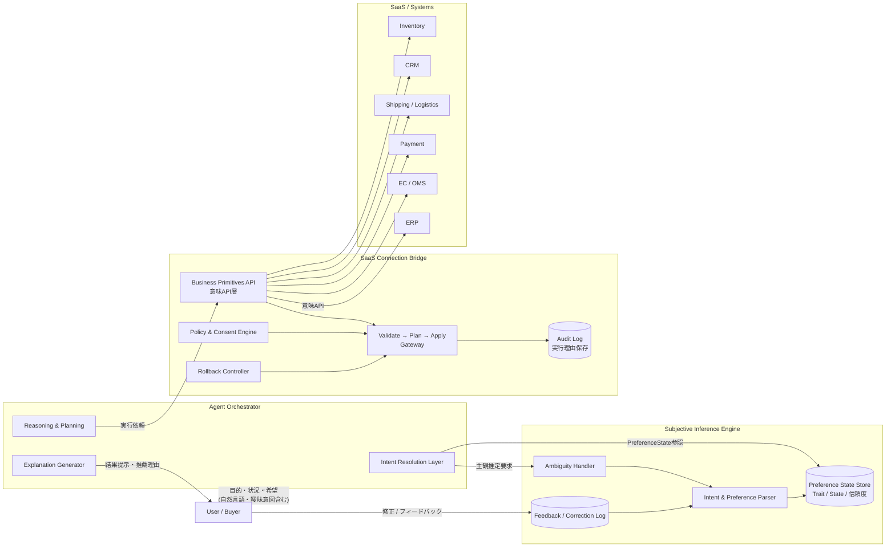
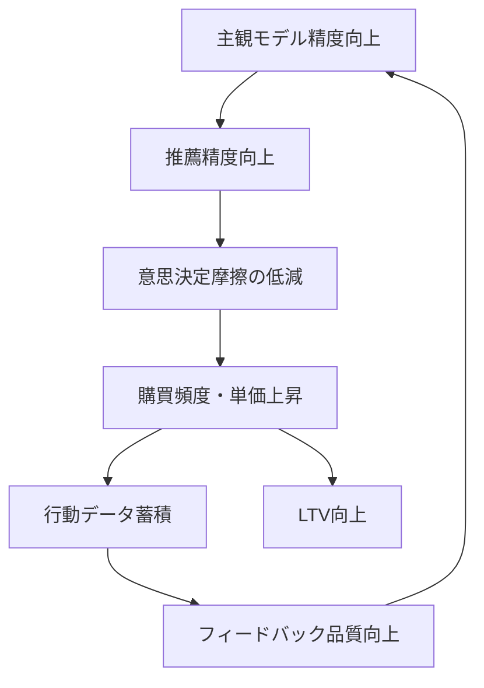

# Subjective Agent Architecture

## 主観モデル × SaaS接続基盤によるエージェント最適化設計

> エージェント最適化社会において、競争はUIや価格ではなく
> **主観モデルとの接続精度**へ移行する。

本リポジトリは、主観推論エンジン（C）とSaaS接続ブリッジ（D）を中核とした
エージェント実行基盤の参照アーキテクチャを提示する。

> **Note**
> 本リポジトリの内容は筆者個人の考察・分析であり、特定の企業・組織の公式見解や社内戦略を反映するものではありません。記載された企業名・数値は公開報道に基づく参照です。

---

## 🗺 ドキュメント構成

| ドキュメント | 役割 |
|---|---|
| **[`/docs/whitepaper.md`](./docs/whitepaper.md)** | 設計思想・競争戦略・参照アーキテクチャの全体定義 |
| **[`/docs/business-mapping.md`](./docs/business-mapping.md)** | 主観三層（Trait/State/Meta）をチャーン率・LTVへ接続する翻訳レイヤー |
| **[`/docs/roadmap.md`](./docs/roadmap.md)** | Phase 0〜5の詳細実装ロードマップ |

---

## 🎯 Problem Statement

従来のEC・SaaSは人間の操作を前提に設計されている。

しかし、エージェントが意図解釈・候補生成・評価・発注/決済/配送実行を担う世界では、競争軸は根本的に変化する。商品は「スペック」ではなく：

> **主観空間への射影**

となる。

ウォルマートのAI買い物エージェント「Sparky」利用顧客の平均注文額は非利用者比+35%であり [^1]、ホーム・デポはAIエージェントによる設計→見積もり→発注の自動化で利益率を向上させている [^1]。一方、「SaaSの死」がSaaS関連株の急落を引き起こしている [^2]。これらは構造変化がすでに始まっていることを示す。

---

## 🧭 Strategic Positioning

エージェント社会の競争領域は4つに分類できる。

| 区分 | 内容 | 特徴 | 新規参入の実現性 |
| :----: | ------ | ------ | :----------------: |
| **A** | 個人主観ウォレット（分散型） | Web3的発想・主観の個人主権 | 理想だが困難 |
| **B** | 中央集権型主観層（巨大PF） | Amazon / Google / Walmart型 | 既存大手が優位 |
| **C** | 主観推論エンジン | 主観を「扱える状態」に変換 | **参入可能** |
| **D** | SaaS接続ブリッジ | SaaS APIを意味APIへ変換 | **参入可能** |

本プロジェクトは **C × D** を戦略的参入点とする。

CとDを押さえることで：

- **Bと接続可能** — プラットフォーム各社のエージェントに主観推論と実行基盤を提供する「裏方」として機能
- **将来Aへ拡張可能** — 主観スキーマの標準化を主導し、個人ポータビリティ層への展開路を確保

---

## 🏗 Architecture Overview



---

## 🧠 C) Subjective Inference Engine

### Purpose

- 主観（Trait / State / Meta）を推定
- 修正ログを学習資産化
- 不確実性を明示

### Preference State の三層構造

| 層 | 更新頻度 | 例 | 信頼度減衰 | KPI接続 |
| --- | --- | --- | --- | --- |
| **Trait**（長期価値観） | 月〜年 | 健康志向、価格感度 | 緩やか | 施策の個別最適化軸 |
| **State**（短期状態） | 時間〜日 | 疲労、予算変動、同伴者 | 急速 | チャーン予兆の検出軸 |
| **Meta**（修正履歴） | イベント駆動 | 「それは違う」ログ | 蓄積型 | 施策精度の継続改善軸 |

> **business-mapping.md との接続**：Trait/State/Metaは「主観の定義」に留まらず、チャーン率・LTV・施策ROIへの直接分解軸として設計されている。詳細は [`/docs/business-mapping.md`](./docs/business-mapping.md) を参照。

### Competitive Advantage

- 主観同定精度
- 修正反映速度（Metaの蓄積速度が重要KPI）
- 説明可能性

---

## 🔌 D) SaaS Connection Bridge

### Purpose

- SaaS APIを意味APIへ抽象化
- 安全実行基盤の提供
- 監査可能な実行

### Core Flow

```text
validate  →  「この操作は許可されているか」（Policy & Consent）
    ↓
plan      →  「何をどの順序で実行するか」（冪等性チェック含む）
    ↓
apply     →  「実行」（ロールバック可能な形で）
    ↓
audit     →  「なぜこの操作を行ったか」（推薦理由 + 主観状態を記録）
```

### Business Primitives Examples

```python
segment_customers(conditions)  # 顧客セグメント作成
send_line_message(segment_id)  # LINE配信
reserve_offer(customer_id)     # 特典予約
cancel_offer(offer_id)         # 特典取消（compensating action）
get_visit_history(customer_id) # 来店履歴取得
quote_price()                  # 見積もり取得
create_order()                 # 発注実行
check_delivery()               # 配送可否照会
```

### Competitive Advantage

- 実行安全性（dry_run / rollback / policy制御）
- 業務原子設計
- 多SaaS接続抽象化

---

## 🔁 Feedback Flywheel



主観モデルの精度はLTVと直結する。ウォルマートにおけるエージェント利用顧客の注文額+35% [^1] はこの因果構造の実証例である。このループの起動条件は**初期の主観同定精度**であり、**Metaの蓄積速度**が重要KPIとなる。

---

## 🚀 Roadmap（概要）

詳細は **[`/docs/roadmap.md`](./docs/roadmap.md)** を参照。

| Phase | 期間 | 内容 | 証明すること |
| --- | --- | --- | --- |
| **Phase 0** | 〜2週間 | 社内モック（state/intent出力） | stateが施策に接続できる構造がある |
| **Phase 1** | 〜2ヶ月 | D層：業務接続（Business Primitives） | state → 実際の業務APIが動く |
| **Phase 2** | 〜3ヶ月 | C層：主観状態管理・学習ループ | 主観状態が蓄積・更新される |
| **Phase 3** | 〜4ヶ月 | 安全性・説明責任強化 | 安全に自律実行できる |
| **Phase 4** | 〜6ヶ月 | 横展開・SaaS統合 | 複数業務ドメインに横展開できる |
| **Phase 5** | 〜1年 | Whitepaper完全体・OSS公開 | Whitepaperが「実装済みの設計思想」になる |

> **戦略的判断軸：「接続できた」から勝つ。「構造が正しい」から勝つのではない。**

---

## 🏁 参考実装：agentic-bizflow

**[KazuakiWatanabe/agentic-bizflow](https://github.com/KazuakiWatanabe/agentic-bizflow)**

agentic-bizflow は、Reader → Validator → Generator の段階処理と Retry Loop による「壊れない業務定義JSON」を実現した実装で、Cloud Run + Vertex AI を前提に動作するデモを提供している。

本リポジトリでは、この実装基盤の出力スキーマを **state / intent / next_actions** 形式に差し替えることで、主観推論エンジン（C）の PoC とする。

```
agentic-bizflow（動く基盤）
    ↓ 出力スキーマ差し替え
subjective-agent-architecture（主観推論 × 業務接続）
```

---

## ⚠ Risks

| リスク | 対応策 |
| --- | --- |
| 主観誤推定 | 信頼度スコアの明示 + 追加質問 |
| 実行暴走 | Validate層強化 + ロールバック機構 |
| プラットフォーム依存 | 接続層の抽象化による多接続対応 |
| 主観サイロ化 | スキーマ標準化（Phase 3） |
| B による内製化 | C/Dの接続実績とスキーマ標準の先行確立で対抗 |

---

## 📌 Vision

エージェント最適化社会の本質は：

> **主観のモデル化と実行基盤の設計**

競争は商品ではなく、**主観モデルとの接続精度**へ移行する。

CとDを押さえることで、今日はBの裏方として機能し、明日はAの標準を牽引する。ここに戦略的機会がある。

---

## 🛠 Status

> **Working Draft** — This is an architecture proposal under active design.
> Implementation is in progress based on [agentic-bizflow](https://github.com/KazuakiWatanabe/agentic-bizflow).

| 項目 | 状態 |
|---|---|
| 出力スキーマ設計 | ✅ 完了 |
| Reader → Validator → Generator パイプライン | ✅ 完了 |
| pytest 37件（E2E含む）全PASS | ✅ 完了 |
| dry_run 安全設計 | ✅ 完了 |
| rollback_plan / trace_id 付与 | ✅ 完了 |
| 業務API実接続（LINE 1パターン） | 🔶 Phase 1 |
| 主観状態管理・学習ループ | ⏳ Phase 2 |

---

## 📝 License

[MIT](./LICENSE)

---

## 📚 References

[^1]: 日本経済新聞「『SaaSの死』に続く『ECの死』　買い物エージェントの破壊力」（2026年2月15日）
<https://www.nikkei.com/article/DGXZQOGN24AAH0U6A220C2000000/>

[^2]: 日本経済新聞「『SaaSの死』余波は銀行・ファンド株まで　米KKRは2日で8%安」（2026年2月）
<https://www.nikkei.com/article/DGXZQOUC021JB0S6A200C2000000/>

---

> *本リポジトリの内容は筆者個人の考察であり、所属する・過去に所属した企業や組織の公式見解・事業戦略を表明するものではありません。*
