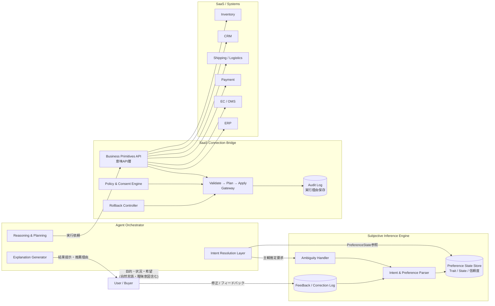
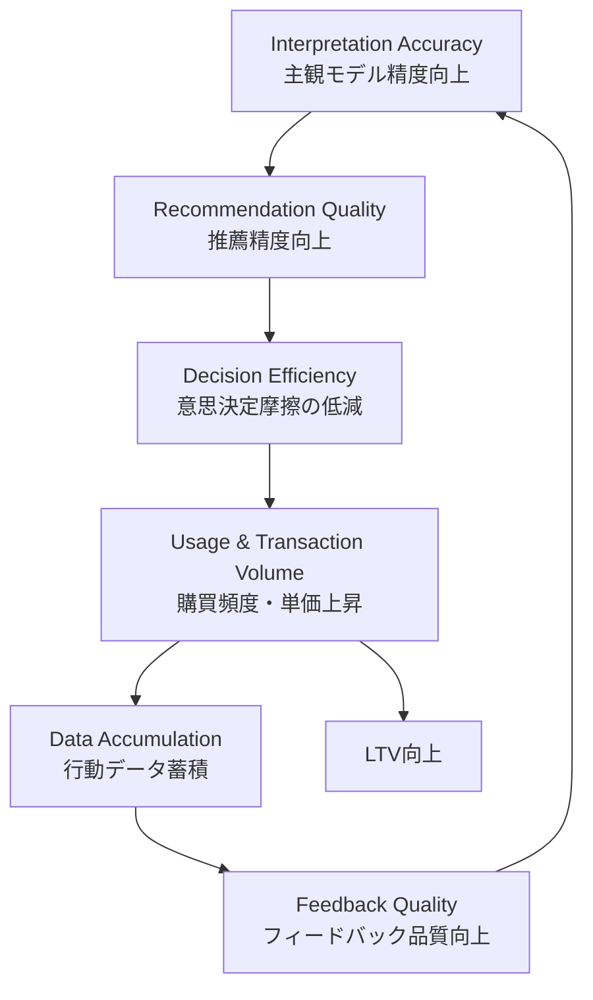

# Subjective Agent Architecture

## Agentic Decision Infrastructure via Subjective Modeling × SaaS Connection
## 主観モデル × SaaS接続基盤によるエージェント意思決定インフラ

> In an agent-optimized society, competition shifts  
> from UI and pricing to **connection accuracy with subjective models**.
>
> エージェント最適化社会において、競争はUIや価格ではなく  
> **主観モデルとの接続精度**へ移行する。

本リポジトリは、主観推論エンジン（C）と SaaS 接続ブリッジ（D）を中核とした  
Agentic Decision Infrastructure の参照アーキテクチャを提示する。

> **Note / 注記**  
> 本リポジトリの内容は筆者個人の考察・設計構想であり、特定の企業・組織の公式見解や社内戦略を反映するものではありません。記載された企業名・数値は公開報道に基づく参照です。

---

## 🎯 Problem Statement / 問題の所在

### The Interpretation Gap

従来の AI システムは以下のスタックで設計されている：

```
Data
 ↓
Prediction
 ↓
（ここで止まる）
```

しかし実際の意思決定が必要とするのは：

```
Data
 ↓
Prediction
 ↓
Interpretation   ← 現在のソフトウェアスタックに欠けている層
 ↓
Decision Support
 ↓
Execution
```

この **Interpretation Layer** の欠如が、エージェント社会における中核的な設計課題である。

### Human-Operated Systems の限界

従来の EC・SaaS は人間の操作を前提に設計されている：

```
User → UI操作 → SaaS → 結果
```

エージェントが意図解釈・候補生成・実行を担う世界では、構造は根本的に変化する：

```
Intent → Agent reasoning → System execution
```

このとき商品やサービスは「スペック」ではなく、**主観空間への射影**として評価される。

ウォルマートのAI買い物エージェント「Sparky」利用顧客の平均注文額は非利用者比 +35% であり [^1]、ホーム・デポは AI エージェントによる設計→見積もり→発注の自動化で利益率を向上させている [^1]。一方、「SaaS の死」がSaaS 関連株の急落を引き起こしている [^2]。これらは Interpretation Gap の実装が競争変数として機能し始めていることを示す。

---

## 🧭 Strategic Positioning / 戦略的ポジション

エージェントエコシステムにおける競争領域は4層に分類できる：

| Layer | Description | 特徴 | 参入可能性 |
| :---: | --- | --- | :---: |
| **A** | Personal Subjective Wallet（分散型） | Web3的・主観の個人主権 | 理想だが困難 |
| **B** | Centralized Agent Platform（巨大PF） | Amazon / Google / Walmart 型 | 既存大手が優位 |
| **C** | Subjective Inference Engine | 主観を「扱える状態」に変換 | **参入可能** |
| **D** | SaaS Connection Bridge | SaaS API を意味 API へ変換 | **参入可能** |

本プロジェクトは **C × D** を戦略的参入点とする。

```
Agent reasoning
 ↓
C — Subjective Inference
 ↓
D — Execution Bridge
 ↓
Enterprise Systems
```

**C × D を押さえることで：**

- **B と接続可能** — プラットフォーム各社のエージェントに主観推論と実行基盤を提供する裏方として機能する
- **A へ拡張可能** — 主観スキーマの標準化を主導し、個人ポータビリティ層への展開路を確保する

---

## 🏗 Architecture Overview / アーキテクチャ全体像


```mermaid
flowchart LR
  U[User / Buyer] -->|"目的・状況・希望\n(自然言語・曖昧意図含む)"| AO

  subgraph AO[Agent Orchestrator]
    IR[Intent Resolution Layer]
    RP[Reasoning & Planning]
    EX[Explanation Generator]
  end

  subgraph C[Subjective Inference Engine]
    AM[Ambiguity Handler]
    SI[Intent & Preference Parser]
    PS[(Preference State Store\nTrait / State / 信頼度)]
    FB[(Feedback / Correction Log)]
    AM --> SI
    SI --> PS
    FB --> SI
  end

  subgraph D[SaaS Connection Bridge]
    BP[Business Primitives API\n意味API層]
    VP[Validate → Plan → Apply\nGateway]
    AL[(Audit Log\n実行理由保存)]
    PC[Policy & Consent Engine]
    RB[Rollback Controller]
    BP --> VP
    VP --> AL
    PC --> VP
    RB --> VP
  end

  subgraph S[SaaS / Systems]
    ERP[ERP]
    EC[EC / OMS]
    PAY[Payment]
    SHIP[Shipping / Logistics]
    CRM[CRM]
    INV[Inventory]
  end

  IR -->|主観推定要求| AM
  IR -->|PreferenceState参照| PS
  RP -->|実行依頼| BP
  BP --> ERP
  BP --> EC
  BP --> PAY
  BP --> SHIP
  BP --> CRM
  BP --> INV
  EX -->|"結果提示・推薦理由"| U
  U -->|"修正 / フィードバック"| FB
```

---

## 🧠 C) Subjective Inference Engine / 主観推論エンジン

### Purpose / 目的

主観（Trait / State / Meta）を構造化・推定し、Interpretation Layer を実装する。

```
Natural language
 ↓
Intent
 ↓
Preference State
 ↓
Confidence-scored output
```

AI は単に予測するのではなく、**意味を生成する（meaning generation）** 基盤として機能する。

### Core Components

| Component | Role / 役割 |
| --- | --- |
| LLM-based Intent Extraction | 自然言語から意図・選好を抽出 |
| Ambiguity Handler | 曖昧意図の欠損検知と自動補完 |
| Preference Vector Modeling | 価値観をベクトル空間で表現 |
| Confidence Scoring | 推定の信頼度を数値化・時間減衰を管理 |
| Feedback Recalibration | 修正ログから推論モデルを校正 |

### Preference State の三層構造 / Three-Layer Preference Model

| Layer | 更新頻度 | 例 | 信頼度減衰 |
| --- | --- | --- | --- |
| **Trait**（長期価値観） | 月〜年 | 健康志向、価格感度 | 緩やか |
| **State**（短期状態） | 時間〜日 | 疲労、予算変動、同伴者 | 急速 |
| **Meta**（修正履歴） | イベント駆動 | 「それは違う」ログ | 蓄積型 |

```
Trait  (long-term values)
 ↓
State  (short-term context)
 ↓
Meta   (correction history)
```

この構造により、**継続的主観更新（continuous subjective recalibration）** が可能になる。

### Competitive Advantage

- 主観同定精度（Interpretation accuracy）
- 修正反映速度（Feedback loop latency）
- 説明可能性（Explainability）

---

## 🔌 D) SaaS Connection Bridge / SaaS 接続ブリッジ

### Purpose / 目的

エージェントが実行できる **意味レベル API（Meaning-Level API）** を提供し、SaaS の操作インターフェースを業務原子単位へ抽象化する。

```
従来:  REST API（技術操作）
     ↓
エージェント向け:  Business Primitives（意味操作）
```

### Core Execution Flow

```
validate  →  「この操作は許可されているか」（Policy & Consent）
    ↓
plan      →  「何をどの順序で実行するか」（冪等性チェック含む）
    ↓
apply     →  「実行」（ロールバック可能な形で）
    ↓
audit     →  「なぜこの操作を行ったか」（推薦理由 + 主観状態を記録）
```

### Business Primitives Examples

```python
quote_price()        # 見積もり取得
reserve_stock()      # 在庫仮確保
create_order()       # 発注実行
cancel_order()       # 注文取消
issue_invoice()      # 請求書発行
check_delivery()     # 配送可否照会
```

この抽象化により、**複数 SaaS を統一した意味操作で管理**できる。

### Competitive Advantage

- 実行安全性（Execution safety）
- 業務原子設計（Business primitive abstraction）
- 多 SaaS 接続抽象化（Multi-SaaS unified interface）

---

## 🔁 Feedback Flywheel / フィードバック・フライホイール


```mermaid
flowchart TD
  A[Interpretation Accuracy\n主観モデル精度向上] --> B[Recommendation Quality\n推薦精度向上]
  B --> C[Decision Efficiency\n意思決定摩擦の低減]
  C --> D[Usage & Transaction Volume\n購買頻度・単価上昇]
  D --> E[Data Accumulation\n行動データ蓄積]
  E --> F[Feedback Quality\nフィードバック品質向上]
  F --> A
  D --> G[LTV向上]
```

主観モデルの精度は LTV と直結する。ウォルマートにおけるエージェント利用顧客の注文額 +35% [^1] はこの因果構造の実証例である。

このループの起動条件は **初期の主観同定精度（Interpretation accuracy）** であり、修正ログの蓄積速度が重要 KPI となる。

---

## 🚀 Roadmap / ロードマップ

現行ロードマップは **チャーン防止ユースケース** を起点に、主観状態を業務・KPI に接続するまでの実装計画として定義されている。

| Phase | Focus | 目標 |
| --- | --- | --- |
| **0A** | Phase 0 完了判定 | 構造証明の完了ゲート通過 |
| **0B** | Demo Reframing | チャーン防止デモへの再編集・KPI 仮定義 |
| **1** | D Layer 業務接続 | Business Primitives × Mock Adapter の最小接続証明 |
| **2** | C Layer 運用開始 | State ↔ チャーン予兆の相関確認・KPI 確定・Meta 蓄積開始 |
| **3** | Safety / Governance | Policy・Consent・Rollback の構造整備 |
| **4** | 横展開 | 複数 SaaS Adapter への拡張 |
| **5** | Whitepaper 再構成 | 実装実績ベースの設計文書として再編 |

> 判断基準：State をきれいに出すことではなく、**State で再来店率を動かせることを証明する**。

詳細なフェーズ定義・スケジュール・KPI 設計は以下を参照：

→ **[`/docs/roadmap_churn_whitepaper_v1.md`](./docs/roadmap_churn_whitepaper_v1.md)**

---

## ⚠ Risks / リスクと対応策

| Risk / リスク | Mitigation / 対応策 |
| --- | --- |
| 主観誤推定（Interpretation error） | 信頼度スコアの明示 + 追加質問 |
| 実行暴走（Runaway execution） | Validate 層強化 + ロールバック機構 |
| プラットフォーム依存（Platform lock-in） | 接続層の抽象化による多接続対応 |
| 主観サイロ化（Subjective silo） | スキーマ標準化（Phase 4 以降） |
| B による内製化（Internalization by platforms） | C/D の接続実績とスキーマ標準の先行確立で対抗 |

---

## 📌 Vision / ビジョン

AI システムはやがて、**分析ツール（analytics tools）** から **意思決定インフラ（decision infrastructure）** へと進化する。

エージェントエコシステムが必要とするのは：

```
Interpretation Layer  （主観推論 — C）
        +
Execution Layer       （SaaS接続 — D）
```

この2層を押さえることで、今日は B の裏方として機能し、明日は A の標準を牽引する。  
**競争の本質は、主観モデルとの接続精度にある。**

---

## 📄 Whitepaper

詳細な戦略・市場分析・アーキテクチャ設計は以下を参照：

→ **[`/docs/whitepaper.md`](./docs/whitepaper.md)**

---

## 🛠 Status

> **Working Draft** — This is an architecture proposal under active design.  
> Implementation modules are not yet available.

---

## 📚 References

[^1]: 日本経済新聞「『SaaSの死』に続く『ECの死』　買い物エージェントの破壊力」（2026年2月15日）  
<https://www.nikkei.com/article/DGXZQOGN24AAH0U6A220C2000000/>

[^2]: 日本経済新聞「『SaaSの死』余波は銀行・ファンド株まで　米KKRは2日で8%安」（2026年2月）  
<https://www.nikkei.com/article/DGXZQOUC021JB0S6A200C2000000/>

---

## 📝 License

[MIT](./LICENSE)

---

> *本リポジトリの内容は筆者個人の考察であり、所属する・過去に所属した企業や組織の公式見解・事業戦略を表明するものではありません。*
