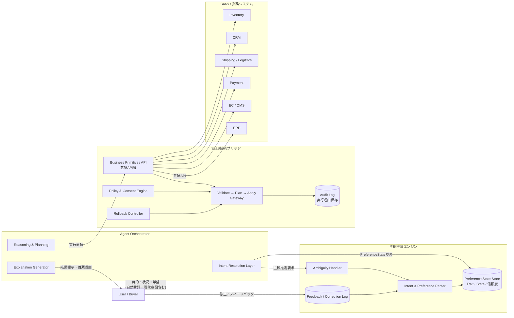
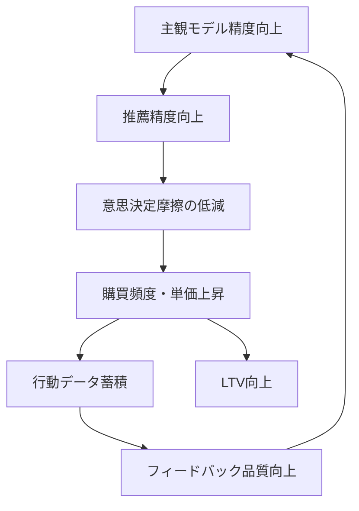

# エージェント最適化社会における競争優位の再定義
## ― 主観モデル × SaaS接続基盤による戦略設計 ―

**著者：[渡邉和明]**
**公開日：2026年2月**

---

> **免責事項**
>
> 本稿は筆者個人の見解に基づく考察であり、特定の企業・組織の公式見解や社内戦略を反映するものではありません。記載された企業名・製品名・数値は公開情報に基づく参照であり、当該企業との資本関係・取引関係・提携関係を示すものではありません。本稿の内容は情報提供を目的としたものであり、投資判断や事業意思決定の根拠として用いることを意図していません。

---

# 1. エグゼクティブサマリー

エージェント最適化社会において、競争軸はUIの優劣・機能数・価格比較から、**主観モデルとの接続精度**へ移行する。

差別化は商品そのものではなく、以下に変化する：

- どの主観空間に強くフィットするか
- その意味をどれだけ構造化できるか
- エージェントが解釈可能な形で提供できるか

エージェント最適化社会の競争領域はA〜Dの4象限に分類できる。本稿は、新規参入者が競争優位を構築可能な**C）主観推論エンジン**と**D）SaaS接続ブリッジ**を中核に据え、この構造変化における戦略的ポジションの設計と実行計画を示す。

---

# 2. 市場構造の変化

## 2.1 従来構造

人間が「検索 → 比較 → 検討 → 購入」を行う。競争軸はUI、マーケティング、露出、CVRであった。

## 2.2 エージェント最適化構造

人間は**目的・主観・状況**のみを渡す。エージェントが意図解釈・候補生成・評価・実行を担う。競争軸は**意味の構造化能力・主観フィット精度・実行基盤の信頼性**へ移る。

## 2.3 市場で起きていること

この構造変化はすでに現実のものとなっている。

日本経済新聞の報道 [^1] によれば、ウォルマートは2025年秋以降、OpenAIやGoogle等と相次いで提携し、アプリ内の買い物エージェント「Sparky」を展開した。同社CEO ジョン・ファーナーは2026年2月19日の決算説明会で、AIエージェント利用顧客の平均注文額が非利用者比で約35%高いことを明らかにしている [^1]。

同報道 [^1] では、ホーム・デポがAIエージェントを活用した工事管理ツールを提供し、ツール上で顧客が設計すると自動的に見積もりを算出、そのまま発注できる仕組みを構築したことも報じられている。同社の2025年11月〜2026年1月期決算は売上高381億ドルと前年同期比約4%減少したものの市場予想を上回り、1年ぶりに株価が上昇した [^1]。

一方、アンソロピックの「Cowork」新機能の公開を契機に、SaaS関連株が急落する「SaaSの死」が市場の関心事となっている [^2]。セールスフォース、インテュイット、アドビなど大手ソフト株が軒並み下落し、その影響は金融やファンドにまで波及した [^2]。

これらの動きは、AIエージェントが既存のソフトウェアと小売の両領域で構造変化を引き起こしていることを示している。

---

# 3. 競争優位の再定義

## 3.1 従来の差別化

商品スペック、ブランド露出、UI体験、価格優位。

## 3.2 新しい差別化

- **主観モデルとの適合度**：消費者の価値観・状態にどれだけ精密にフィットするか
- **曖昧意図の構造化能力**：「今日の晩ご飯どうしよう」から具体的な提案を生成できるか
- **推薦理由の説明可能性**：なぜこの商品・サービスを選んだかをエージェントが説明できるか
- **意味タグの解像度**：商品情報がエージェントにとって解釈可能な粒度で構造化されているか
- **実行の安全性**：発注・決済・配送を自律的かつ可逆的に実行できるか

日経報道 [^1] が引用するAWSシニアアーキテクト、マーティン・サコウスキー氏の指摘は示唆的である。同氏は、既存のオンラインショップは人間の目と指のために構築されており、今後はAIエージェントが消費者の目的を達成するための設計が重要になると述べている [^1]。

商品は「スペック」ではなく、**主観空間への射影**となる。

---

# 4. 主観モデルの戦略的意味

主観は以下の三層で構成される。

## 4.1 長期価値観（Trait）

価格感度、ブランド志向、健康志向、冒険性、安定志向など。更新頻度は月〜年単位で低く、信頼度の減衰は緩やかである。

## 4.2 短期状態（State）

疲労、予算変動、イベント、季節性、同伴者など。更新頻度は日〜時間単位で高く、信頼度は急速に減衰する。

## 4.3 修正履歴（Meta）

「それは違う」「前回の方が良い」「優先順位を変えたい」といったフィードバック。イベント駆動で蓄積され、推論モデルの校正に用いられる。

競争優位は、**主観をどれだけ低摩擦でモデル化できるか**に依存する。ウォルマートにおけるエージェント利用顧客の注文額+35% [^1] という数字は、主観モデルの精度がLTVに直結することを示唆している。

---

# 5. 戦略ポジションの全体像

エージェント最適化社会における競争領域は、大きく4つに分類できる。

## 5.1 A）主観ウォレット（個人ポータビリティ層）

**役割：** 主観モデルを個人に帰属させ、プラットフォーム横断で利用可能にし、主観の主権を個人側に保持する。

**特徴：** Web3的発想に基づく分散型ID連携と、同意ベースのアクセス制御。

**課題：** 標準化の難易度、UX負荷、初期データ不足、ネットワーク効果の壁。

理想的な構造だが、即時実現性は低い。

## 5.2 B）中央集権型プラットフォーム主観層

**役割：** 大規模行動データを活用し、協調フィルタリング・トレンド反映・高速学習を行う。

**特徴：** Amazon型・Google型・Walmart型。ウォルマートの「Sparky」[^1] やアマゾンの買い物エージェントは、いずれもこの象限で自社エコシステム内の主観モデルを構築している。

**課題：** 主観の囲い込み、サイロ化、定義権の集中。

現実の主戦場であり、既存大手が圧倒的に優位。

## 5.3 C）主観推論エンジン

**役割：** 自然言語・行動ログから主観状態を推定し、Trait / State / Metaを統合し、修正ログを学習資産化する。

**特徴：** 主観を「扱える状態」に変換する中核レイヤー。プラットフォームに依存しない設計が可能。

**競争優位要素：** 主観同定精度、修正反映速度、不確実性管理、説明可能性。

**技術要素：**

- LLMベース意図抽出
- ベクトル化された価値空間
- 状態遷移管理
- 信頼度スコアリング
- フィードバック学習ループ

## 5.4 D）SaaS接続ブリッジ

**役割：** SaaS APIを「意味API」に変換し、エージェント実行の安全基盤を提供し、監査・冪等性・ロールバックを担保する。

**特徴：** 業務原子設計、Validate → Plan → Apply フロー、実行理由保存。

**競争優位要素：** 実行安全性、業務抽象化精度、多SaaS接続能力。

**技術要素：**

- 業務原子API設計
- イベント駆動アーキテクチャ
- トランザクション整合性
- 監査証跡保存
- アクセス制御

「SaaSの死」論争 [^2] においてSaaS企業の存続が問われているが、SaaS自体が消滅するのではなく、SaaSの**インターフェースがUI中心からAPI中心に再設計される**ことが本質的変化である。SaaS接続ブリッジは、この再設計を媒介する位置に立つ。

## 5.5 戦略的選択

4象限を俯瞰すると、参入可能性と競争優位の構築可能性は以下のように整理される。

```mermaid
quadrantChart
    title 戦略ポジション・マトリクス
    x-axis 即時実現性 低 --> 高
    y-axis 競争優位構築可能性 低 --> 高
    A) 主観ウォレット: [0.2, 0.7]
    B) プラットフォーム主観層: [0.8, 0.3]
    C) 主観推論エンジン: [0.6, 0.85]
    D) SaaS接続ブリッジ: [0.75, 0.75]
```

**Aは理想だが、即時実現性が低い。** 標準化・ネットワーク効果・UXの3つの壁を同時に越える必要がある。

**Bは既存巨大プラットフォームの領域。** データ量と顧客接点で先行する大手に対し、新規参入者が正面から競争するのは非合理的である。

**新規参入者が算入可能であり、かつ競争優位を構築可能なのは C と D である。**

CとDを押さえることで：

- **Bと接続可能**：プラットフォーム各社のエージェントに対し、主観推論と実行基盤を提供する「裏方」として機能できる
- **将来Aへ拡張可能**：主観スキーマの標準化を主導することで、個人ポータビリティ層への展開路を確保できる

この中間ポジションこそが、本稿の戦略的核心である。

---

# 6. SaaS再設計の方向性

従来のSaaSはUI中心・画面単位設計・人間操作前提であった。再設計後は、業務原子単位・状態遷移明確化・意味タグ付与・イベント公開・エージェント呼出前提へ移行する。

SaaSは**アプリケーションから実行ノードへ**変化する。

ホーム・デポの事例 [^1] はこの変化を先取りしている。同社の工事管理ツールは、従来なら人間が画面を操作して行っていた「設計→見積もり→発注」のフローを、AIエージェントが業務原子単位で実行する構造に転換した。

---

# 7. 参照アーキテクチャ

本章では、C）主観推論エンジンとD）SaaS接続ブリッジを中核とした参照アーキテクチャを示す。

## 7.1 全体構成



## 7.2 設計上の重要ポイント

### 7.2.1 曖昧意図の構造化

日経報道 [^1] が指摘するとおり、エージェントが最大の価値を発揮するのは、消費者の目的が「はっきりしていない」「まだ探していない」状態においてである。従来のECは「検索→比較→購入」という明確な意図を前提としていたが、エージェントは曖昧な意図から出発する。

Ambiguity Handlerは以下を担う：

- **意図の欠損検知**：「今日の晩ご飯」のような曖昧入力から、不足情報（人数・予算・制約）を特定
- **主観状態との照合**：過去のPreference Stateから推定可能な情報を自動補完
- **追加質問の最小化**：信頼度スコアに基づき、確認すべき項目を最小限に絞る

### 7.2.2 実行安全性の確保

エージェントが発注・決済・配送手配を自律的に行う以上、実行の安全性は最重要設計要件である。

```
validate: 「この操作は許可されているか」（Policy & Consent）
    ↓
plan:     「何をどの順序で実行するか」（冪等性チェック含む）
    ↓
apply:    「実行」（ロールバック可能な形で）
    ↓
audit:    「なぜこの操作を行ったか」（推薦理由 + 主観状態を記録）
```

ホーム・デポの事例 [^1] で材料価格が他店より高くても利便性で選ばれる構造が成立しているのは、エージェントが価格以外の主観的価値（利便性・信頼性・即時性）を正しく評価し、その理由を説明できることが前提である。Audit Logに実行理由を保存することで、この説明可能性を担保する。

### 7.2.3 フィードバックループとLTV向上

主観モデルの精度向上はLTV向上に直結する。以下のフライホイール構造が成立する：



このループの起動条件は**初期の主観同定精度**である。フェーズ2では修正ログの蓄積速度を重要KPIとして設定すべきである。

## 7.3 適用例：「今日の晩ご飯どうしよう」

本アーキテクチャの動作を、日経報道 [^1] でも言及された「今日の晩ご飯」の例で示す。

1. **User → Agent**：「今日の晩ご飯」（曖昧意図）
2. **Ambiguity Handler**：Preference Stateから「2人世帯」「健康志向中」「平日は30分以内調理」を補完
3. **Intent Resolution**：「30分以内で作れる2人分の健康的な夕食の食材調達」に構造化
4. **Business Primitives API**：在庫照会（Inventory）→ メニュー生成 → 当日配送可否確認（Shipping）→ 決済（Payment）
5. **Validate → Plan → Apply**：予算上限チェック → 配送時間帯確認 → 発注実行
6. **Explanation Generator**：「旬の鮭と季節野菜のグリルを提案しました。調理時間25分、2人分で1,480円です。前回好評だった魚料理を優先しました」
7. **Feedback**：ユーザーが「今日は肉がいい」→ Meta層に記録 → 次回の推定に反映

---

# 8. 主観ポータビリティの進化シナリオ

第5章で示した4象限の時間的展開を示す。

### 現実フェーズ：B + D が先行

企業間API連携型（D）が先行し、中央集権型プラットフォーム（B）が主戦場となる。主観は企業内に保持され、部分的に連携される。ウォルマート、ホーム・デポ等の大手各社が独自のエージェントを構築する現状 [^1] がこれにあたる。

### 歪みの発生：C の必要性が顕在化

主観の分断、推薦の不整合、エージェント間の競合が生じる。例えば、食品購入エージェントが把握する健康志向と、家電購入エージェントが把握する予算感度が断絶する。プラットフォーム横断で主観を統合的に推論する能力（C）への需要が高まる。

### 次段階：A への展開

分断への不満が、個人ウォレット型（A）的な主観ポータビリティ需要を生む。CとDを通じて蓄積された主観スキーマの実績が、Aの標準化を牽引する。

この進化シナリオにおいて、**CとDは「今日の参入点」であると同時に「明日のAへの橋頭堡」である**。

---

# 9. 競争戦略とロードマップ

## フェーズ1：実行基盤の確立（D中心）

- SaaS接続ブリッジの構築
- 業務原子API定義
- validate → plan → apply フローの実装
- 実行安全基盤（監査ログ、ロールバック）の整備

## フェーズ2：主観推論の実装（C中心）

- 主観推論エンジンの実装
- 修正ログの蓄積開始（蓄積速度をKPIに設定）
- 主観状態管理モデル（Trait / State / Meta）の確立
- フィードバックループの稼働

## フェーズ3：標準化と拡張（A への展開）

- 主観スキーマの標準化提案
- 外部連携の拡張（B各社との接続）
- 主観ポータビリティ基盤への展開

## 戦略的含意

**参入障壁の形成**：主観推論エンジン（C）は修正ログの蓄積により精度が向上するため、先行者は時間とともに模倣困難な競争優位を構築できる。これはネットワーク効果ではなく、**学習効果による参入障壁**である。

**プラットフォーム・ポジション**：SaaS接続ブリッジ（D）は、既存SaaS事業者にとっても「エージェントからの呼び出しに対応する」ための必須基盤となる。「SaaSの死」[^2] が議論される中、SaaS事業者がエージェント対応を迫られる局面こそ、この基盤にプラットフォーム的ポジションを確立する機会である。

**B との共存戦略**：CとDは、B（大手プラットフォーム）と正面から競争するのではなく、Bの裏側で主観推論と実行安全性を提供する構造をとる。これにより、プラットフォーム間の競争が激化するほど、CとDへの需要が増大するというポジションが成立する。

---

# 10. リスクと対応

| リスク | 対応策 |
|---|---|
| 主観誤推定 | 信頼度スコアの明示 + 信頼度が低い場合の追加質問 |
| 実行暴走 | validate層の強化 + ロールバック機構 |
| プラットフォーム依存 | 接続層の抽象化による多接続対応 |
| 主観サイロ化 | スキーマ標準化（フェーズ3）による段階的解消 |
| B による内製化 | C/Dの接続実績とスキーマ標準の先行確立で対抗 |

---

# 11. 結論

エージェント最適化社会の本質は、ECの死でもUIの終焉でもない。

本質は、**主観のモデル化と実行基盤の設計**である。

競争領域はA〜Dの4象限に分かれる。理想はA（主観ウォレット）だが即時実現は困難であり、B（プラットフォーム主観層）は既存大手の領域である。新規参入者が競争優位を構築可能なのは**C（主観推論エンジン）とD（SaaS接続ブリッジ）**であり、この2領域を押さえることで、Bと接続し、将来Aへ拡張する中間ポジションを確立できる。

ウォルマートやホーム・デポの事例 [^1] が示すとおり、消費者の曖昧な意図を構造化し、専門領域の実行基盤と接続する能力が競争優位に直結する時代はすでに始まっている。先行する者が修正ログと実行実績を蓄積し、学習効果による参入障壁を構築する。ここに戦略的機会がある。

---

# 参考文献

[^1]: 日本経済新聞「『SaaSの死』に続く『ECの死』　買い物エージェントの破壊力」（2026年2月15日、ウォール街ラウンドアップ）
https://www.nikkei.com/article/DGXZQOGN24AAH0U6A220C2000000/

[^2]: 日本経済新聞「『SaaSの死』余波は銀行・ファンド株まで　米KKRは2日で8%安」（2026年2月）
https://www.nikkei.com/article/DGXZQOUC021JB0S6A200C2000000/

---

> **本稿について**
>
> 本稿は筆者個人の考察・分析であり、筆者が所属する、または過去に所属した企業・組織の公式見解、事業戦略、投資方針を表明するものではありません。記載されている企業事例・数値データはすべて上記の公開報道に基づいています。
